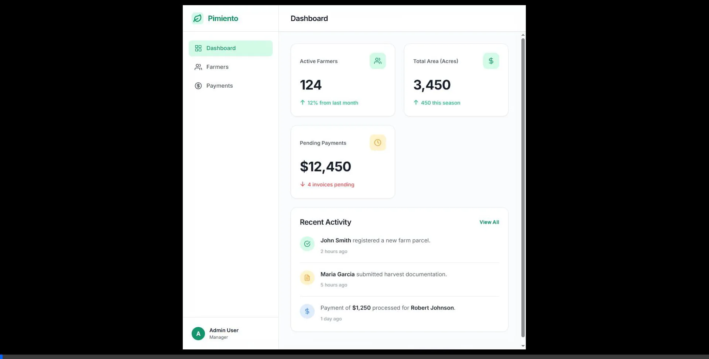

# Pimiento Farm Management App

A modern, clean, and minimalist web and mobile application for managing farms, tracking active farmers, and processing payments. 



## Features

- **Dashboard Overview**: Track active farmers, total acreage, and pending payments at a glance.
- **Farmers Directory**: View registered farmers and add new ones using an interactive modal.
- **Payments System**: Process new payments and view historical transaction records.
- **Cross-Platform**: Includes a Vanilla HTML/CSS/JS web implementation, as well as a complete Expo/React Native architecture for Android and iOS.

## How to Run Locally

### Web Application
The web app is purely frontend (built without Node.js or a bundler). You can run it locally with any basic HTTP server:
```bash
# Using Python
python -m http.server 8000
```
Then navigate to `http://localhost:8000` in your browser.

### Mobile Application (React Native / Expo)
The mobile version is located in the `mobile-app` directory. To run it:
1. Open the folder: `cd mobile-app`
2. Install dependencies: `npm install`
3. Start the Expo server: `npx expo start`
4. Use the Expo Go app on your phone to scan the QR code.